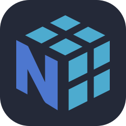
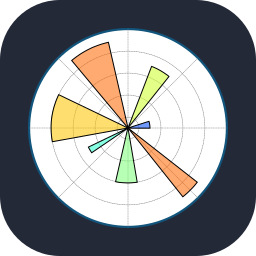

  
  
  
  

<link rel="stylesheet" align="left" href="https://cdnjs.cloudflare.com/ajax/libs/font-awesome/6.6.0/css/all.min.css" integrity="sha512-Kc323vGBEqzTmouAECnVceyQqyqdsSiqLQISBL29aUW4U/M7pSPA/gEUZQqv1cwx4OnYxTxve5UMg5GT6L4JJg==" crossorigin="anonymous" referrerpolicy="no-referrer" />

### Hi there, I'm Het,  👋

I'm currently learning more about Transformers, MLOps, and NLP. Also, I'm actively learning new things and applying in the real world projects. You can know about me through my [Resume](https://drive.google.com/file/d/1CnsgxPq8CeDD75qWY4NAi31KotTsAzc6/view?usp=sharing)

### What I'm Doing:
- 🌱 Currently learning **NLP & Transformers**  
- 💡 ML/DL enthusiast who loves integrating AI into **real-world applications**  
- 🔭 Love **math** and stay updated with the **latest AI research**  
- ⚡ Fun fact: I love experimenting
- 📫 Reach me at **bhalanihet2006@gmail.com**
- 📄 My Resume

 

  

## 🛠️ Tech Stack

  
### 📊 Machine Learning & Data Science

   

### 🌐 Web Development

### 🖥️ Programming Languages

### 🛢️ Databases & Tools

### 📱 App Development

### ⚙️ Environments, Tools & Version Control

 
 

  

 
 

