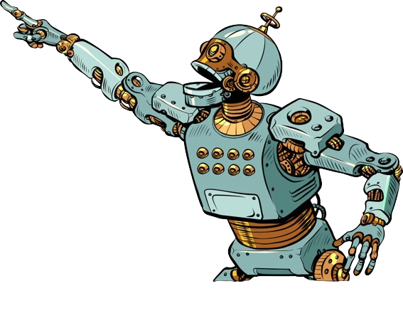

<h1 align="center">Hey, I'm <b>Het Bhalani</b> 👋</h1>

  <b>Self-taught ML/DL/NLP Engineer</b>  

  I love building intelligent systems, exploring deep learning architectures, and connecting technology with creativity.  
  Currently diving deep into <b>Transformers, NLP, and MLOps</b> and applying what I learn to real-world projects. More about me in my 
  <a href="https://drive.google.com/file/d/1SOu2SZYA871z5jeLJp26pd3UjtB6uhH5/view?usp=sharing" target="_blank">
    <b>Resume</b>
  </a>

---

### 🚀 About Me

- 🧠 Always learning something new, currently **GenAI, Finetuning & MLOps**
- 🤖 Passionate about building **AI-driven applications**
- 🔭 Love **math** and stay updated with the **latest AI research**  
- ⚡ Fun fact: I love experimenting
- 📫 Reach me: **bhalanihet2006@gmail.com**

---

  

### 🌐 Connect With Me

  
  
  
  
  

---

### 🧩 I don’t limit myself to one thing, I love exploring everything.

> “AI, music, math, philosophy, games and cinema all are forms of patterns waiting to be understood.”

---

