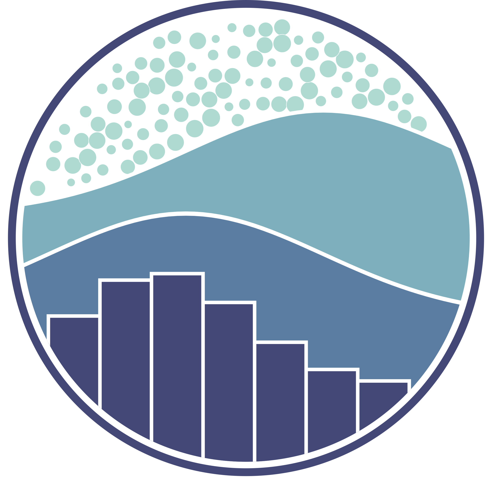

<h3 align="center">Hi, This is Het Bhalani :wave: </h3>
 

  
  
  
  

<link rel="stylesheet" align="left" href="https://cdnjs.cloudflare.com/ajax/libs/font-awesome/6.6.0/css/all.min.css" integrity="sha512-Kc323vGBEqzTmouAECnVceyQqyqdsSiqLQISBL29aUW4U/M7pSPA/gEUZQqv1cwx4OnYxTxve5UMg5GT6L4JJg==" crossorigin="anonymous" referrerpolicy="no-referrer" />

- 🌱 I’m currently learning **Python and Machine-Learning**
- 💡 I’m a **Machine Learning enthusiast** working on integrating AI into real-world applications
- 🔭 **love to explore math, physics and stay updated with AI field**
- ⚡ Fun fact **I love to learn something new everyday**
- 📫 How to reach me **bhalanihet2006@gmail.com**
 

  

<h3 align="left">Languages and Tools:</h3>

  
  
  
  
  
  
  
  
  
  
  
  
  
  
  
  
  
  
  
  
  
  
  
  
   
  
  
  
  
  
   
  
   
  
   
  
   
  
 

 
 

  

 
 

